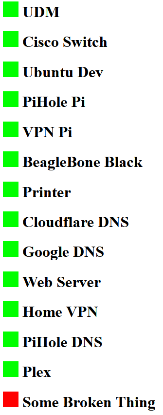

# SimpleNetworkMonitor
Ping devices and load sites to check the status of a home network

# How it works
Run the server

`python3 server.py`

The server will respond to get requests with the following format

 `serveraddress:port/method-address`

Where the server address and port are where ever you run server.py
Method can be either a ICMP ping or a get request.

If a ping or HTTP 200 response is found a green png will be return, if they fail a red png will be returned.

# Usage
Create a simple HTML file on the target device.
To check a device is active (e.g. a Raspberry Pi)

`<h1>  PiHole Pi </h1>`

To check a web service is running (e.g. Plex)

`<h1>  Plex </h1>`

To make the page auto reload every n seconds add this to the head tag

`<meta http-equiv="refresh" content="360">`

# Example

In the example below the Raspberry Pi running PiHole is being checked with a ping, and the PiHole service it's self is being check by loading the admin webpage.

